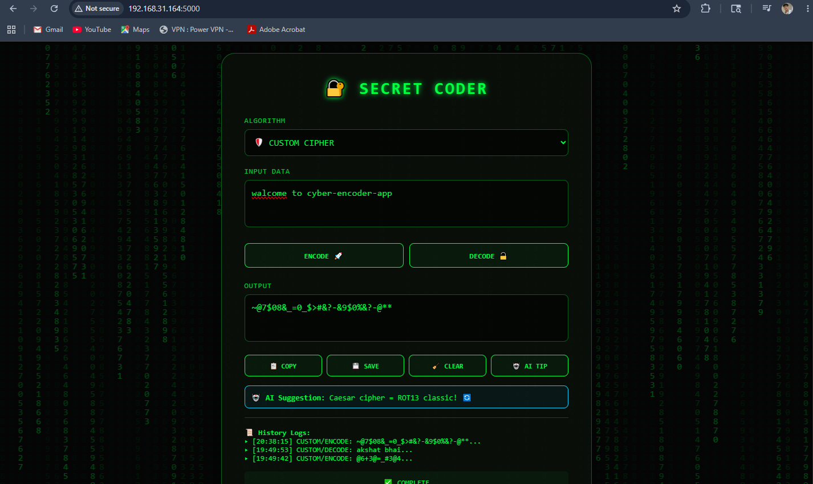

# 🔐 CYBER ENCODER APP

A Flask-based secret message encoder web app that converts normal text into unique encrypted symbol-based code.

---

## 📸 Preview




---

## 🌐 Live Demo

Local Version:

```text
https://cyber-encoder-app.onrender.com
```

Render deployment link will be added soon.

---

## ✨ Features

* 🔒 Convert normal messages into secret encoded text
* ⚡ Instant encoding system
* 🌐 Simple web interface
* 🧠 Custom symbol-based encryption style
* 💻 Built using Flask and Python
* 📱 Lightweight and fast

---

## 🛠️ Tech Stack

* Python
* Flask
* HTML
* CSS

---

## 🚀 How It Works

1. User enters a normal message
2. App processes the text
3. Message converts into encrypted symbol code
4. Encoded message is displayed instantly

Example:

```text
walcome to cyber-encoder-app
↓
~@7$08&_=0_$>#&?-&9$0%&?-@**
```


---

## 🎯 Purpose

This project was created to experiment with secret text encoding, Flask web apps, and custom encryption-style logic.And to creat a strong password.

---

 👨‍💻 Author
 
Pranjal Gupta
Python Developer | AI Builder | Automation Creator
